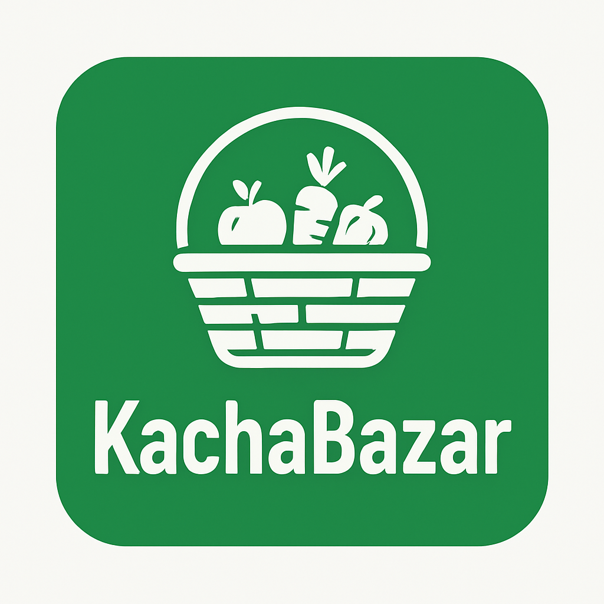

# 🛒 KachaBazar E-Commerce Platform

**KachaBazar** is a comprehensive e-commerce platform that connects customers directly with farmers, eliminating middlemen and enabling fair, transparent, and efficient grocery purchasing. The platform supports both **B2B** (bulk purchases directly from farmers) and **B2C** (direct customer orders from warehouse stock).



## 🚀 Project Status: **STABLE & READY FOR DEVELOPMENT**

✅ **Backend**: Express.js server with MongoDB - **WORKING**  
✅ **Authentication**: JWT-based user auth - **IMPLEMENTED**  
✅ **API Endpoints**: User & Product CRUD - **FUNCTIONAL**  
✅ **Frontend**: Next.js application - **CONFIGURED**  
✅ **Database**: MongoDB connection - **STABLE**  
✅ **Development Environment**: VS Code tasks & scripts - **READY**

## 🌟 Features

### For Customers
- �️ Browse and purchase fresh groceries
- 🛒 Shopping cart management
- 📦 Order tracking and history
- 💳 Multiple payment options
- 🔍 Advanced product search and filtering
- ❤️ Wishlist functionality
- 📱 Responsive mobile-friendly design

### For Farmers/Sellers
- � Product listing and management
- 📊 Sales dashboard and analytics
- 📦 Inventory management
- 💰 Earnings tracking
- 🚛 Order fulfillment system

### For Administrators
- 👥 User management
- 📈 Platform analytics
- 🛡️ Content moderation
- 💼 Business intelligence

## 🏗️ Architecture

### Backend (Node.js + Express)
- **Authentication**: JWT-based with role-based access control
- **Database**: MongoDB with Mongoose ODM
- **File Upload**: Multer for image handling
- **Security**: Input validation, password hashing, CORS protection
- **API**: RESTful API design with comprehensive error handling

### Frontend (Next.js + React)
- **Framework**: Next.js 15 with App Router
- **Styling**: Tailwind CSS for responsive design
- **State Management**: React Context API
- **HTTP Client**: Axios with interceptors
- **Notifications**: React Hot Toast
- **Forms**: React Hook Form for validation

## 🚀 Quick Start

### Prerequisites
- Node.js 18+
- MongoDB 5.0+
- npm or yarn

### One-Command Setup
```bash
# Install all dependencies for both backend and frontend
npm run install-all

# Start both servers concurrently
npm run dev
```

### Manual Setup

1. **Start MongoDB**
   ```bash
   # Windows (as Administrator)
   net start MongoDB
   
   # macOS/Linux
   sudo systemctl start mongod
   ```

2. **Backend Setup**
   ```bash
   cd kachabazar-backend
   npm install
   npm run dev  # Starts on http://localhost:5000
   ```

3. **Frontend Setup**
   ```bash
   cd kachabazar-frontend
   npm install
   npm run dev  # Starts on http://localhost:3000
   ```

4. **Test the API**
   ```bash
   cd kachabazar-backend
   node test-api.js  # Runs comprehensive API tests
   ```

### VS Code Development
- Use `Ctrl+Shift+P` → "Tasks: Run Task" to run predefined tasks
- Available tasks: "Start Backend Server", "Start Frontend Server", "Test Backend API"

### Installation

1. **Clone the repository**
   ```bash
   git clone <repository-url>
   cd KachaBazar
   ```

2. **Setup Backend**
   ```bash
   cd kachabazar-backend
   npm install
   cp .env.example .env  # Configure your environment variables
   node seed.js          # Seed database with sample data
   npm run dev           # Start development server
   ```

3. **Setup Frontend**
   ```bash
   cd kachabazar-frontend
   npm install
   cp .env.local.example .env.local  # Configure environment variables
   npm run dev                       # Start development server
   ```

4. **Access the Application**
   - Frontend: http://localhost:3000
   - Backend API: http://localhost:5000
   - API Documentation: http://localhost:5000/health

### Test Accounts
After seeding the database, use these accounts:
- **Admin**: admin@kachabazar.com / admin123
- **Seller**: john.farmer@gmail.com / password123
- **Customer**: mike.customer@gmail.com / password123

## 📁 Project Structure

```
KachaBazar/
├── kachabazar-backend/
│   ├── models/              # Database schemas
│   │   ├── users.js
│   │   ├── Product.js
│   │   ├── Cart.js
│   │   └── Order.js
│   ├── routes/              # API endpoints
│   │   ├── users.js
│   │   ├── products.js
│   │   ├── cart.js
│   │   ├── orders.js
│   │   └── upload.js
│   ├── middleware/          # Custom middleware
│   │   └── auth.js
│   ├── uploads/             # File storage
│   ├── server.js           # Main server file
│   ├── seed.js             # Database seeding
│   └── package.json
│
├── kachabazar-frontend/
│   ├── app/                # Next.js pages
│   │   ├── (withLayout)/   # Pages with header/footer
│   │   └── (withoutLayout)/ # Auth pages
│   ├── Components/         # React components
│   │   ├── Header.js
│   │   ├── Hero.js
│   │   ├── Categories.js
│   │   └── FeaturedProducts.js
│   ├── context/            # React context
│   │   └── UserContext.js
│   ├── lib/                # Utilities
│   │   ├── api.js          # API functions
│   │   └── utils.js        # Helper functions
│   ├── public/             # Static assets
│   └── package.json
│
├── SETUP.md               # Detailed setup guide
└── README.md              # This file
```

## 🔌 API Endpoints

### Authentication
```
POST   /api/users/register     # Register new user
POST   /api/users/login        # Login user
GET    /api/users/profile      # Get user profile
PUT    /api/users/profile      # Update profile
POST   /api/users/addresses    # Add delivery address
```

### Products
```
GET    /api/products/all-products        # Get all products with filters
GET    /api/products/featured            # Get featured products
GET    /api/products/product/:id         # Get single product
POST   /api/products/add-product         # Add new product (seller)
PUT    /api/products/update-product/:id  # Update product
DELETE /api/products/delete-product/:id  # Delete product
GET    /api/products/my-products         # Get seller's products
GET    /api/products/search              # Search products
```

### Shopping Cart
```
GET    /api/cart              # Get user's cart
POST   /api/cart/add          # Add item to cart
PUT    /api/cart/update/:id   # Update cart item quantity
DELETE /api/cart/remove/:id   # Remove item from cart
DELETE /api/cart/clear        # Clear entire cart
```

### Orders
```
POST   /api/orders/create           # Create new order
GET    /api/orders/my-orders        # Get user's orders
GET    /api/orders/:id              # Get single order
PUT    /api/orders/:id/status       # Update order status
GET    /api/orders/seller/orders    # Get seller's orders
GET    /api/orders/admin/all        # Get all orders (admin)
```

### File Upload
```
POST   /api/upload/image       # Upload single image
POST   /api/upload/images      # Upload multiple images
DELETE /api/upload/image/:name # Delete image
```

## 🛡️ Security Features

- **Authentication**: JWT tokens with secure HTTP-only cookies option
- **Authorization**: Role-based access control (Admin, Seller, Customer)
- **Input Validation**: Comprehensive validation for all API endpoints
- **Password Security**: Bcrypt hashing with salt rounds
- **CORS Protection**: Configured for cross-origin requests
- **File Upload Security**: File type validation and size limits
- **SQL Injection Prevention**: MongoDB + Mongoose ORM
- **XSS Protection**: Input sanitization

## 🔧 Environment Variables

### Backend (.env)
```bash
PORT=5000
MONGO_URI=mongodb://localhost:27017/kachabazar
JWT_SECRET=your_super_secret_jwt_key_here
NODE_ENV=development
```

### Frontend (.env.local)
```bash
NEXT_PUBLIC_API_URL=http://localhost:5000
NEXT_PUBLIC_APP_URL=http://localhost:3000
```

## 🧪 Testing

```bash
# Backend tests
cd kachabazar-backend
npm test

# Frontend tests
cd kachabazar-frontend
npm test
```

## � Deployment

### Backend (Node.js)
- **Recommended**: Railway, Render, or AWS EC2
- Configure production environment variables
- Set up MongoDB Atlas for production database
- Use PM2 for process management

### Frontend (Next.js)
- **Recommended**: Vercel, Netlify, or AWS S3 + CloudFront
- Configure production API URLs
- Enable static optimization where possible

### Database
- **Development**: Local MongoDB
- **Production**: MongoDB Atlas, AWS DocumentDB

## 🛣️ Roadmap

### Phase 1 (Current) ✅
- [x] User authentication and authorization
- [x] Product catalog management
- [x] Shopping cart functionality
- [x] Order management system
- [x] Basic admin features

### Phase 2 (Next)
- [ ] Payment gateway integration (Stripe, PayPal)
- [ ] Email notifications
- [ ] Advanced search with Elasticsearch
- [ ] Product reviews and ratings
- [ ] Real-time chat support

### Phase 3 (Future)
- [ ] Mobile app (React Native)
- [ ] Advanced analytics dashboard
- [ ] Multi-vendor marketplace features
- [ ] AI-powered recommendations
- [ ] Blockchain-based supply chain tracking

## 🤝 Contributing

1. Fork the repository
2. Create your feature branch (`git checkout -b feature/AmazingFeature`)
3. Commit your changes (`git commit -m 'Add some AmazingFeature'`)
4. Push to the branch (`git push origin feature/AmazingFeature`)
5. Open a Pull Request

## 📝 License

This project is licensed under the MIT License - see the [LICENSE](LICENSE) file for details.

## 🙏 Acknowledgments

- Icons by [Font Awesome](https://fontawesome.com/)
- UI Components inspired by modern e-commerce platforms
- Photography from [Unsplash](https://unsplash.com/)

## 📞 Support

- **Documentation**: Check SETUP.md for detailed setup instructions
- **Issues**: Create an issue on GitHub
- **Email**: support@kachabazar.com

---

**Built with ❤️ for connecting farmers and customers directly**
